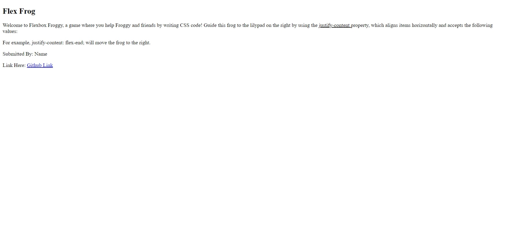
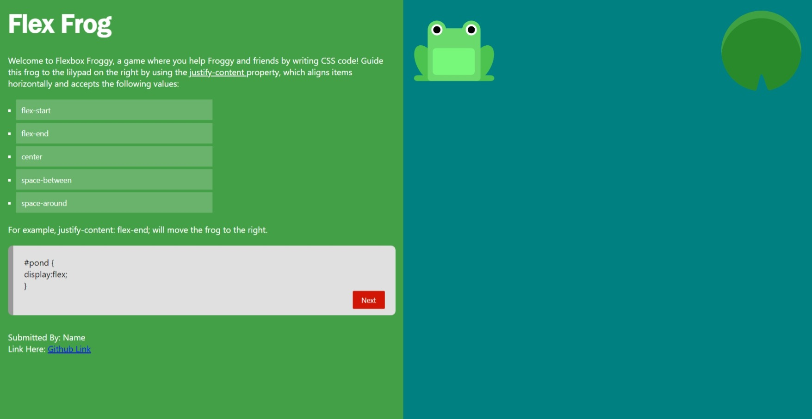

## IN HOUSE TRAINING
---

## WEEK 1 
Mentor : Akash Negi

Topic
 - HTML
 - CSS
 - JavaScript

### Start Image

All the images used in the project should be of dimension `150 px x 150 px`


Please do not edit code unless specified.

Tasks (10)

 - Link the StyleSheet
 - Add the CSS property to container class  ( ```HINT: use flex``` )
 - Add background-color to body : `#43A047`
 - Start with the left section first
 - Add the necessary CSS properties to left__section class
 - Add unordered list to the left__section and add class `list__values` to it.
 - Add class of `list__item` to each list item inside the unordered list
 - Edit the div element with class `code__block` and refer the final   
   picture to see the changes that needs to be made
 - Edit the `right__section` and add the image as shown in the final 
   image

    Image Links are :

       http://flexboxfroggy.com/images/frog-green.svg

       http://flexboxfroggy.com/images/lilypad-green.svg
     

   `HINT : use FLEX to align images`
 - Finally, upload code to GitHub and share the link


### Startup Image



### Final Image




Practice Resources :

[Flex Box](https://flexboxfroggy.com/)

[w3schools](https://www.w3schools.com/)

[mdn docs](https://developer.mozilla.org/en-US/docs/Learn)


## All the Best 👍